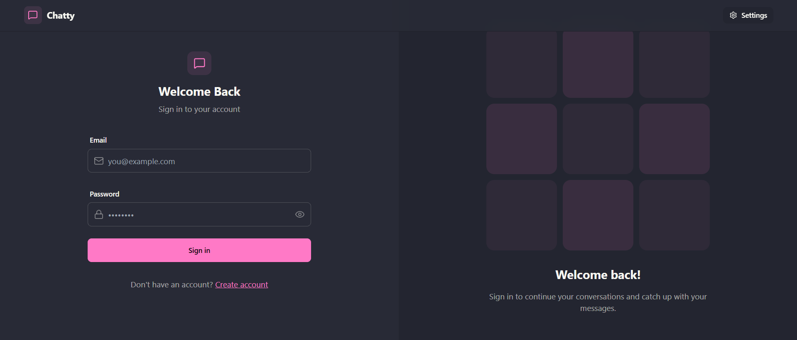

# 💬 Chat App

Full-stack chat application with authentication and real-time messaging.

---

## 🚀 Live Demo

The application is available at:  
👉 **https://chat-app-i0io.onrender.com**

---




## 🛠 Tech Stack

- **Frontend:** React, Vite, TailwindCSS, daisyUI  
- **Backend:** Node.js, Express  
- **Database:** MongoDB  
- **Real-time:** Socket.io  

---


Frontend and backend are **fully separated** and run independently in local development.

---

## ▶️ Local Development

Run frontend and backend in **two separate terminals**.

```bash
# Terminal 1 – Backend
cd backend
npm run dev

# Terminal 2 – Frontend
cd frontend
npm run dev
